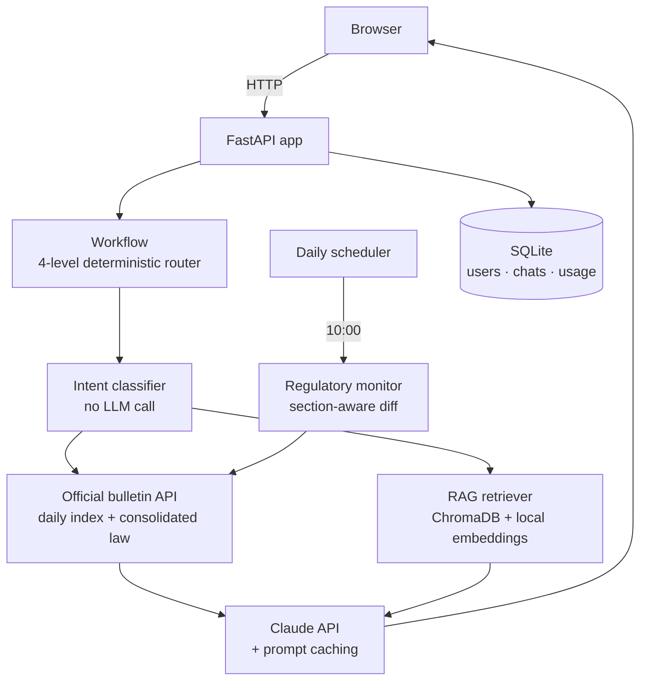

# Regulatory RAG Chatbot

> A conversational assistant for querying Spain's official bulletin (BOE) and a team's own
> indexed technical standards (PDFs), with Retrieval Augmented Generation and automated
> regulatory-change monitoring.

<p align="center">
  
  
  
  
  
</p>

> This is an anonymized, standalone extract of one module from a larger internal platform
> I built at an engineering company. Company-specific references have been removed or
> genericized; the architecture, code structure and design decisions are real.

## Problem → Solution → Result

**Problem.** Technical teams need to track Spanish national legislation (BOE) alongside their
own reference standards (ISO, UNE, internal procedures as PDFs) and get alerted automatically
when something they rely on is amended or repealed — instead of manually re-checking documents.

**Solution.** A RAG chatbot that answers questions against both a live government API and a
private, versioned PDF library, with a deterministic (non-LLM) intent router that decides
whether to query the BOE, the indexed documents, or both — and a daily background job that
re-reads the official bulletin's XML and classifies, section by section, whether each indexed
document was actually repealed, amended, or merely *mentioned* in a preamble with no legal effect.

**Result.** Deterministic routing removes an LLM call per query just to classify intent
(~50 tokens saved per request). Legal-section-aware change detection (see below) distinguishes
real regulatory impact from incidental mentions — collapsing what used to require a manual
document review into an automatic daily check with a cited evidence trail.

---

## Architecture

Single FastAPI application. `src/shared/` is a small support library (Anthropic client, token
accounting, pricing, migration runner) with no routes, no DB access and no templates — shared
with the sibling [report-generator](https://github.com/cesucede17/report-generator) module, but
each tool ships and runs independently.



### Key design decisions

| Decision | Why |
|---|---|
| **Local embeddings** (`sentence-transformers`) | No per-query API cost; one-time ~120 MB download; good enough quality for the legal domain |
| **Deterministic 4-level routing** (no LLM for intent) | ~50 tokens saved per query; heuristics cover ≥95% of real traffic |
| **Dual-block system prompt with prompt caching** | Base rules always cached; optional "team context" block appended without invalidating the cache |
| **Legal-section-aware diffing** | A law can *mention* a standard in its preamble with zero legal effect, or *repeal* it in a closing disposition — conflating the two gives false alerts |
| **Semantic + lexical reranking** | Legal text needs exact article/date matches on top of semantic similarity — pure embedding similarity misses this |
| **Own SQLite instance per tool, not shared** | Two independent tools behind the same reverse proxy; isolating state lets either be redeployed or reset without risking the other |
| **Pinned dependency versions** | A newer `anthropic` client breaks `langsmith`'s wrapper, and `starlette` ≥1.6 changes how routes are introspected — upgraded deliberately, with the test suite passing, never by automatic resolution |

---

## Retrieval pipeline

```
User query
   │
   ▼
1. Specific-document detection — does the query name an indexed PDF?
   │  yes → WHERE filter in ChromaDB (that document only)
   │  no  → global search
   ▼
2. Query embedding (5 min cache)
   ▼
3. ChromaDB search — normalized L2 distance, top_k × 2 candidates, threshold filter
   ▼
4. Post-retrieval reranking — 60% semantic similarity + 40% lexical overlap (BM25-lite)
   ▼
5. Context compression — budget ~1200 tokens, keep only query-relevant sections
   ▼
6. Claude call with compressed context
```

Documents are chunked with a legal-aware splitter that prioritizes natural boundaries
(`Article → Provision → Chapter → Title → Annex`) at ~1800 characters with 20% overlap, so a
chunk maps to roughly one complete legal article instead of an arbitrary character cut.

## Automated regulatory monitor

A background job checks daily whether indexed documents have been affected by new legislation,
in three stages:

1. **Document-type routing** — standards bodies' own catalogs vs. the national bulletin, depending
   on document type.
2. **Jurisdiction filter** — discards regional/local publications, keeping only national-level ones.
3. **Legal-section analysis** — downloads the bulletin's XML and splits it into zones (preamble,
   articles, repealing provisions, final provisions); only a match inside an *operative* zone
   (not the preamble) is treated as a real effect, each with a confidence score.

| Status | Meaning |
|---|---|
| `in_force` | No changes detected |
| `mentioned_no_effect` | Referenced in a preamble, no operative effect |
| `partially_amended` | Referenced in an article or final provision |
| `repealed` | Referenced in a repealing provision |
| `superseded` | Standard replaced by a newer version |

Each alert carries a JSON evidence block: the affected articles, the literal text snippet, the
causing regulation, and the effective date — so a human can verify the classification in seconds
instead of re-reading the source document.

## Team contexts (slash commands)

Users can prefix a question with a slash command to scope answers to their team's domain
(e.g. `/energy`, `/grid`, `/mobility` — the exact set is configurable). The active context is
prepended to Claude's system prompt and stays compatible with prompt caching; adding a new one
is a config entry, no code change.

---

## Stack

Python 3.11+ · FastAPI · ChromaDB · sentence-transformers · LangChain (text splitting) ·
Claude API (Anthropic) · SQLite · APScheduler · JWT auth

## Running it

```bash
uv sync
cp .env.example .env     # set ANTHROPIC_API_KEY and the admin passwords
./run.ps1                # or: uv run uvicorn chatbot.main:app --app-dir src --reload --port 8501
# → http://127.0.0.1:8501
```

First run downloads the embedding model (~120 MB) and creates the SQLite database with two
seed users from the passwords in `.env`.

## Authentication

JWT in an httpOnly, `samesite=strict` cookie; bcrypt-hashed passwords; login rate-limited to 5
attempts / 5 min per IP; per-user daily query quota and concurrency limit; `admin` role for the
management panel (document re-indexing, users, usage/cost dashboard).

## Project structure

```
regulatory-rag-chatbot/
├── run.ps1
├── pyproject.toml
├── .env.example
├── src/
│   ├── chatbot/
│   │   ├── main.py              # FastAPI app: auth, chat, admin, API routes
│   │   ├── auth.py              # JWT, SQLite schema, rate limiting
│   │   ├── core/
│   │   │   ├── workflow.py          # 4-level router + answer generation
│   │   │   ├── llm_handler.py       # Claude API + dual-block prompt caching
│   │   │   ├── rag_retriever.py     # Retrieval with filtering + reranking
│   │   │   ├── vector_store.py      # ChromaDB wrapper
│   │   │   ├── regulatory_search.py # Consolidated-law API client
│   │   │   ├── document_monitor.py  # Daily change-detection job
│   │   │   ├── reranker.py          # Semantic + lexical reranking
│   │   │   └── context_compressor.py
│   │   ├── templates/ / static/
│   └── shared/                  # Anthropic client, usage tracking, pricing, migrations
├── data/                        # SQLite + uploaded PDFs (not in git)
├── vectordb/                    # ChromaDB store (not in git, rebuilt on reindex)
└── tests/
    ├── unit/
    └── integration/
```

## Security

| Measure | Implementation |
|---|---|
| Auth | JWT httpOnly + `samesite=strict` |
| Passwords | bcrypt (hash + salt) |
| Brute force | 5 attempts / 5 min per IP → 429 |
| SQL injection | Parameterized queries |
| XSS | Jinja2 autoescaping |
| Path traversal | Filename sanitization on upload |
| Production | `COOKIE_SECURE=true` behind an HTTPS reverse proxy |

## Limitations & next steps

- Routing heuristics are tuned for Spanish legal text; porting to another jurisdiction's
  documents would need a new intent-classification ruleset.
- The regulatory monitor only covers the national bulletin; regional/local sources are
  deliberately filtered out, not yet supported.
- No automated eval set for retrieval quality yet — relevance was tuned manually against a
  sample of real queries.

## License

MIT — see [LICENSE](LICENSE). Anonymized portfolio extract; not the original production
repository.
